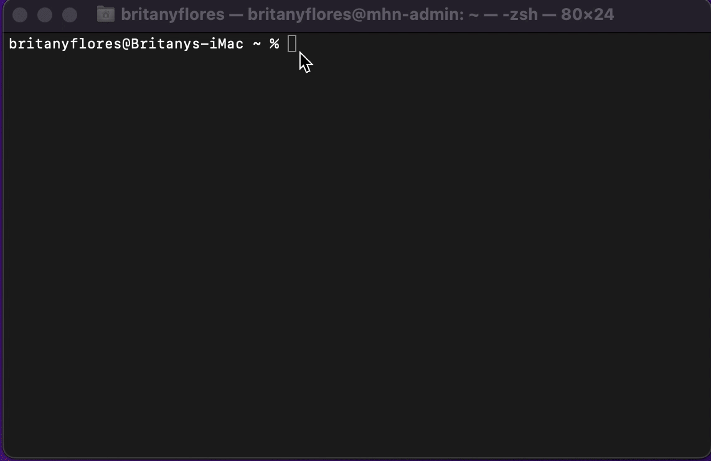

# Project - Honeypot 

Time spent: 8 hours spent in total

> Objective:  Stand up a basic honeypot and demonstrate its effectiveness at detecting and/or collecting data about an attack

## MHN Admin Deployment

Description: Deploy mhn-admin in local machine

## Dioanaea Honeypot Deployment

Description: execute the wget command inside the honeypot-1 VM to install the Dionaea software to collect data about an attack

## Database Backup (session.json)

Description: export data collected from honeypots

## Additional Honeypot(s) Deployed

## Magenpot Honeypot-2 

Description: execute the wget command inside the honeypot-2 VM to install the Magenpot software to collect data about an attack

## Drupot Honeypot-3

Description: execute the wget command inside the honeypot-3 VM to install the Drupot software to collect data about an attack

## Notes

My biggest challenge was not getting many attacks 
